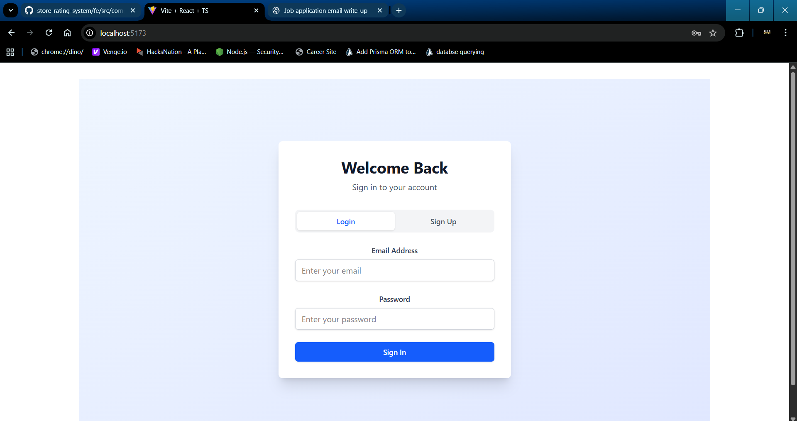
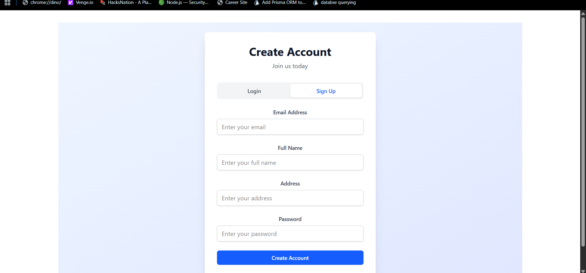
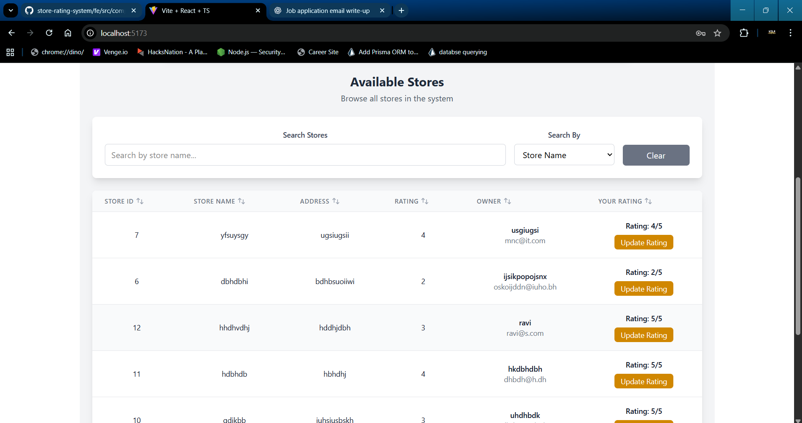

## 📦 Backend Setup Guide

### **Dependencies**
- **Prisma**
- **PostgreSQL** (server or Docker instance)
- **Node.js** v24.5.0
- **npm** v11.5.1

---

## 🚀 Steps to Start Backend

### **1. Run PostgreSQL instance on Docker**
```bash
docker run --name pg_server -p 5432:5432 -e POSTGRES_PASSWORD=pass -d postgres
```


### **1.2. create database storedb**
```bash
    docker exec -it pg_server psql -U postgres
    create database storedb
```
### **3. install dependencies**
```bash
 npm i
 ```

### **4. Setup Prisma**
```bash
 npx prisma migrate reset
 npx prisma migrate dev --name testing
 npx prisma generate
```
### ** 5. start backend**
```bash
  npm run dev
```

## Note 
  -You have to crete env with DATABASE_URL and PORT 
  -Create the first admin user through db 


## Future Improvements

- **Security Enhancement with JWT or OAuth**  
  Implement secure authentication and authorization using JSON Web Tokens (JWT) or OAuth 2.0 to protect APIs and user sessions.

- **Password Hashing**  
  Store user passwords securely by encoding them using **bcrypt** or **Argon2**, ensuring sensitive data is never stored in plain text.

- **Helmet Integration**  
  Use the `helmet` middleware to set secure HTTP headers, helping reduce common vulnerabilities.

- **Robust Logging**  
  Implement a detailed logging mechanism using libraries like **morgan**, integrated with file-based or cloud logging solutions for better monitoring and debugging.


## 📦 Frontend Setup Guide Setup Guide
## 🚀 Steps to Start Backend
```bash
   npm i
   npm run dev
```


# Project UI Screenshots

This document showcases the user interface of the project.

---

## 1. Login Page


## 1. Sign Up Page


---

## 2. Admin Dashboard


---

## 3. User Dashboard


# rating form


---

## 4. Store Dashboard


---

> **Reset Password:** 


## Future Improvements

- **Security — Proper Toasting Mechanism**  
  Implement a custom alert/toast system to improve the UI and provide clear, user-friendly messages.

- **Zod Validation**  
  Enhance input constraints and error handling using the Zod resolver for better form validation.

- **Persisting User State in Session Storage**  
  Sync application context with session storage to retain user state across page reloads.

